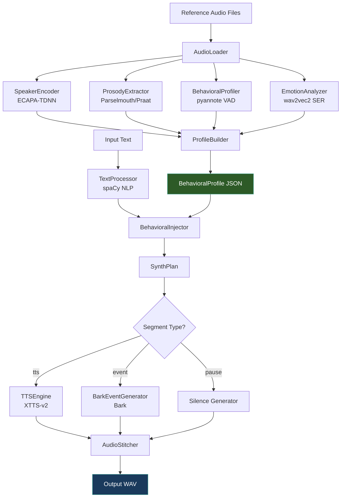

<p align="center">
  <h1 align="center">🎙️ AI Voice Cloning System</h1>
  <p align="center">
    <strong>Clone not just a voice — clone how someone speaks.</strong>
  </p>
  <p align="center">
    Fully open-source · Zero-shot cloning · XTTS-v2 + Bark · Python 3.10+
  </p>
</p>

<p align="center">
  <a href="#-features">Features</a> •
  <a href="#-architecture">Architecture</a> •
  <a href="#-installation">Installation</a> •
  <a href="#-quick-start">Quick Start</a> •
  <a href="#-cli-reference">CLI Reference</a> •
  <a href="#-modules">Modules</a> •
  <a href="#-configuration">Configuration</a>
</p>

---

## ✨ Features

Most voice cloning tools replicate **timbre** only. This system captures the speaker's **full vocal behaviour**:

| Feature | How It Works |
|---------|-------------|
| 🎵 **Voice Timbre** | ECAPA-TDNN speaker embeddings + XTTS-v2 zero-shot cloning |
| ⏸️ **Pause Patterns** | Statistical pause profiling — histogram-sampled, position-aware |
| 🌬️ **Breathing** | Breath event detection + Bark-generated inhale/exhale audio |
| 😊 **Emotion** | wav2vec2 speech emotion recognition → XTTS parameter conditioning |
| 🤫 **Whispers** | Energy-based whisper detection + DSP whisper effect synthesis |
| 💬 **Filler Words** | "uh", "um", "like" — detected from reference, injected probabilistically |
| 📈 **Prosody** | F0 contour, intensity, speaking rate, jitter/shimmer/HNR via Praat |
| 🎭 **Speaking Style** | Formal/casual classification, trailing-off detection, uptalk tendency |

**Fully open-source** — no paid APIs, no cloud dependencies. Runs entirely on your machine.

---

## 🏗️ Architecture



### Two-Model Stack

| Model | Role | Strength |
|-------|------|----------|
| **Coqui XTTS-v2** | Primary TTS + voice cloning | Best zero-shot cloning from just 6s of audio. 17 languages. |
| **Bark (Suno AI)** | Paralinguistic events | Generates breaths, sighs, laughs, fillers, whispered speech. |

---

## 📦 Installation

### Prerequisites

- Python 3.10+
- CUDA GPU recommended (CPU works but is 10-20× slower)
- ~4 GB disk space for model downloads on first run

### Setup

```bash
# Clone the repository
git clone https://github.com/danishansari-dev/voice-cloning.git
cd voice-cloning

# Create virtual environment (recommended)
python -m venv venv
venv\Scripts\activate        # Windows
# source venv/bin/activate   # Linux/macOS

# Install dependencies
pip install -r requirements.txt

# Download spaCy language model
python -m spacy download en_core_web_sm
```

### Optional: HuggingFace Token

If you want to use `pyannote.audio` for high-quality Voice Activity Detection:

1. Create a [HuggingFace account](https://huggingface.co)
2. Accept the [pyannote model terms](https://huggingface.co/pyannote/voice-activity-detection)
3. Add your token to `.env`:
   ```
   HUGGINGFACE_TOKEN=hf_your_token_here
   ```

> **Note:** If the token is missing, the system automatically falls back to `webrtcvad` — everything still works.

---

## 🚀 Quick Start

### 1. Profile a Speaker

Place 1+ audio files (`.wav`, `.mp3`, `.flac`) in a directory, then:

```bash
python main.py profile --audio-dir ./reference_clips --name "my_speaker"
```

This runs all five analysis stages and saves a `BehavioralProfile` JSON:

```
profiles/
└── my_speaker/
    ├── profile.json       # Full behavioural profile
    ├── reference.wav      # Best 6s clip selected for XTTS
    └── embedding.npy      # 192-dim speaker embedding
```

### 2. Synthesise Speech

```bash
python main.py speak --name "my_speaker" --text "Hello, how are you doing today?"
```

### 3. Synthesise from a Script File

```bash
python main.py speak-file --name "my_speaker" --input script.txt --output output/narration.wav
```

---

## 📖 CLI Reference

### `profile` — Build a Speaker Profile

```bash
python main.py profile --audio-dir <DIR> --name <NAME> [--lang en]
```

| Option | Required | Default | Description |
|--------|----------|---------|-------------|
| `--audio-dir`, `-d` | ✅ | — | Directory with reference audio files |
| `--name`, `-n` | ✅ | — | Speaker name (used for saving/loading) |
| `--lang`, `-l` | ❌ | `en` | Language code (XTTS supports 17 languages) |

### `speak` — Synthesise Text

```bash
python main.py speak --name <NAME> --text <TEXT> [--emotion neutral] [--output path.wav] [--play]
```

| Option | Required | Default | Description |
|--------|----------|---------|-------------|
| `--name`, `-n` | ✅ | — | Speaker name |
| `--text`, `-t` | ✅ | — | Text to synthesise |
| `--emotion`, `-e` | ❌ | `neutral` | Emotion: `neutral`, `happy`, `sad`, `angry`, `whisper` |
| `--output`, `-o` | ❌ | `output/<name>_output.wav` | Output file path |
| `--play`, `-p` | ❌ | `false` | Play audio after synthesis |

### `speak-file` — Synthesise from File

```bash
python main.py speak-file --name <NAME> --input <FILE> [--emotion neutral] [--output path.wav] [--play]
```

| Option | Required | Default | Description |
|--------|----------|---------|-------------|
| `--name`, `-n` | ✅ | — | Speaker name |
| `--input`, `-i` | ✅ | — | Path to text file |
| `--emotion`, `-e` | ❌ | `neutral` | Emotion override for all paragraphs |
| `--output`, `-o` | ❌ | `output/<name>_full.wav` | Output file path |
| `--play`, `-p` | ❌ | `false` | Play audio after synthesis |

### `list-profiles` — Show Saved Profiles

```bash
python main.py list-profiles
```

---

## 🧩 Modules

### Pipeline (Analysis)

| Module | Class | Purpose |
|--------|-------|---------|
| `pipeline/audio_loader.py` | `AudioLoader` | Load, preprocess (22050 Hz, mono, trim silence), chunk, select best 6s reference clip by SNR |
| `pipeline/speaker_encoder.py` | `SpeakerEncoder` | ECAPA-TDNN speaker embeddings (192-dim) via SpeechBrain |
| `pipeline/prosody_extractor.py` | `ProsodyExtractor` | F0 (pitch), intensity, speaking rate, jitter/shimmer/HNR via Parselmouth |
| `pipeline/behavioral_profiler.py` | `BehavioralProfiler` | Pause timing, breathing events, filler word detection, whisper segments, speaking habits |
| `pipeline/emotion_analyzer.py` | `EmotionAnalyzer` | wav2vec2-based speech emotion recognition, emotion fingerprinting |
| `pipeline/profile_builder.py` | `ProfileBuilder` | Orchestrates all extractors → `BehavioralProfile` dataclass |

### Synthesis (Generation)

| Module | Class | Purpose |
|--------|-------|---------|
| `synthesis/text_processor.py` | `TextProcessor` | spaCy NLP: sentence/clause boundaries, lexicon-based emotion estimation |
| `synthesis/bark_events.py` | `BarkEventGenerator` | Generates breaths, fillers, whispers, laughs via Bark |
| `synthesis/behavioral_injector.py` | `BehavioralInjector` | Converts text + profile → SynthPlan (ordered segment list) |
| `synthesis/emotion_conditioner.py` | `EmotionConditioner` | Maps emotion labels → XTTS sampling params (speed, temperature, top_k, top_p) |
| `synthesis/tts_engine.py` | `TTSEngine` | XTTS-v2 wrapper + full pipeline orchestration |
| `synthesis/audio_stitcher.py` | `AudioStitcher` | Resamples, crossfades, normalises, saves final WAV |

---

## ⚙️ Configuration

All constants live in [`config.py`](config.py):

| Constant | Default | Description |
|----------|---------|-------------|
| `SAMPLE_RATE_XTTS` | `22050` | XTTS-v2 native sample rate |
| `SAMPLE_RATE_BARK` | `24000` | Bark native sample rate |
| `SAMPLE_RATE_UNIFIED` | `22050` | Final output sample rate |
| `REFERENCE_CLIP_DURATION` | `6.0` | Seconds of reference audio for XTTS |
| `SILENCE_THRESHOLD_DB` | `-40.0` | Trim silence below this level |
| `MIN_PAUSE_DURATION_S` | `0.15` | Ignore pauses shorter than this |
| `BREATH_ENERGY_THRESHOLD` | `0.2` | Fraction of mean energy for breath detection |
| `WHISPER_AMPLITUDE_FACTOR` | `0.4` | Amplitude scaling for whisper effect |
| `CROSSFADE_DURATION_MS` | `20` | Overlap between consecutive speech clips |
| `NORMALIZE_TARGET_DB` | `-3.0` | Peak normalisation level |
| `FILLER_INJECTION_PROB` | `0.25` | Probability of injecting a filler word |
| `DEVICE` | auto | `cuda` if available, else `cpu` |

---

## 📁 Project Structure

```
voice-cloning/
├── main.py                          # CLI entry point (Typer + Rich)
├── config.py                        # Central configuration
├── requirements.txt                 # Dependencies
├── .env                             # HuggingFace token (optional)
├── pipeline/
│   ├── __init__.py
│   ├── audio_loader.py              # Load & preprocess audio
│   ├── speaker_encoder.py           # ECAPA-TDNN embeddings
│   ├── prosody_extractor.py         # Pitch, intensity, rate
│   ├── behavioral_profiler.py       # Pauses, breathing, fillers
│   ├── emotion_analyzer.py          # Speech emotion recognition
│   └── profile_builder.py           # Merge all → BehavioralProfile
├── synthesis/
│   ├── __init__.py
│   ├── text_processor.py            # NLP text parsing
│   ├── bark_events.py               # Paralinguistic audio events
│   ├── behavioral_injector.py       # Profile → SynthPlan
│   ├── emotion_conditioner.py       # Emotion → XTTS params
│   ├── tts_engine.py                # XTTS-v2 voice cloning
│   └── audio_stitcher.py            # Merge & normalise audio
├── models/                          # Auto-downloaded model weights
├── profiles/                        # Saved BehavioralProfile JSONs
└── output/                          # Generated audio files
```

---

## 🔧 Requirements

- **Python**: 3.10+
- **GPU**: NVIDIA CUDA GPU recommended (RTX 2060+ or equivalent)
- **RAM**: 8 GB minimum, 16 GB recommended
- **Disk**: ~4 GB for model downloads

### First-Run Model Downloads

| Model | Size | Source |
|-------|------|--------|
| XTTS-v2 | ~1.8 GB | Coqui TTS |
| Bark | ~1.5 GB | Suno AI |
| ECAPA-TDNN | ~100 MB | SpeechBrain |
| wav2vec2 SER | ~400 MB | HuggingFace |
| spaCy en_core_web_sm | ~12 MB | spaCy |

All models are cached after the first download.

---

## 🗣️ Supported Languages

XTTS-v2 supports 17 languages out of the box:

`en` · `es` · `fr` · `de` · `it` · `pt` · `pl` · `tr` · `ru` · `nl` · `cs` · `ar` · `zh` · `ja` · `hu` · `ko` · `hi`

Use the `--lang` flag when profiling:

```bash
python main.py profile --audio-dir ./clips_hindi --name "speaker_hi" --lang hi
```

---

## 📄 License

This project is open-source. Individual model weights are subject to their respective licenses:

- **XTTS-v2**: [Coqui Public Model License](https://coqui.ai/cpml)
- **Bark**: [MIT License](https://github.com/suno-ai/bark/blob/main/LICENSE)
- **SpeechBrain**: [Apache 2.0](https://github.com/speechbrain/speechbrain/blob/develop/LICENSE)
- **wav2vec2 models**: [Apache 2.0](https://huggingface.co/facebook/wav2vec2-base)

---

<p align="center">
  Built with ❤️ using Python · XTTS-v2 · Bark · SpeechBrain · Parselmouth · spaCy
</p>
